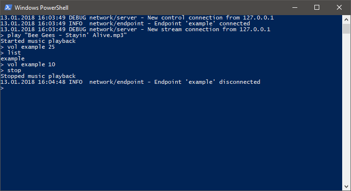

# multispeaker [](https://travis-ci.org/medusalix/multispeaker) [](https://github.com/medusalix/multispeaker/releases/latest)



multispeaker is a command-line utility that lets you stream MP3 files from one master to multiple other clients.
It is cross-platform and has support for Windows, macOS and Linux.

**NOTE:** *multispeaker does not have network latency compensation!
It is therefore recommended to use it on local networks.*

## Usage

multispeaker can be launched in client or server mode by specifying the `-client <ip>` or `-server` command-line flags.
By default, it listens on port 12345 (control port) and port 12346 (stream port).
You can configure these ports by adding `-control-port <port>` or `-stream-port <port>` to the arguments.
The logging level can be set through the `-log <level>` flag.

A default address for the client to connect to can be specified. See section [Building](#building).
When used, the console window is hidden if no arguments are given or forced by specifying the `-hide` flag (*only on Windows*).

When launched, multispeaker can be interactively controlled through a number of commands:

| Command                   | Description                                                                                                        |
|---------------------------|--------------------------------------------------------------------------------------------------------------------|
| list                      | Prints a list of all currently connected users.                                                                    |
| play \<file>              | Starts playback of a specified MP3 file.                                                                           |
| stop                      | Stops the music playback.                                                                                          |
| vol <user\|all> \<volume> | Sets the system volume of a users's computer. If `all` is supplied, the volume of all connected users is changed.  |
| exit                      | Exits the program.                                                                                                 |

## Building

You can download multispeaker via the following command:

```
go get github.com/medusalix/multispeaker
```

You can create an executable using the included [build scripts](scripts) (*Windows only*) or manually by running `go build`.
If you want to set a default address for the client, you can use the `-X` linker flag:

```
go build -ldflags "-X main.defaultClientAddr=192.168.178.1"
```

## License

multispeaker is released under the [Apache 2.0 license](LICENSE).

```
Copyright (C) 2018 Medusalix

Licensed under the Apache License, Version 2.0 (the "License");
you may not use this file except in compliance with the License.
You may obtain a copy of the License at

    http://www.apache.org/licenses/LICENSE-2.0

Unless required by applicable law or agreed to in writing, software
distributed under the License is distributed on an "AS IS" BASIS,
WITHOUT WARRANTIES OR CONDITIONS OF ANY KIND, either express or implied.
See the License for the specific language governing permissions and
limitations under the License.
```
